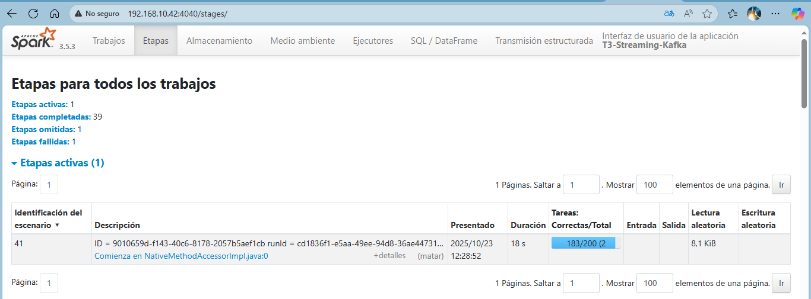

# T3 – Spark + Kafka (Streaming + Batch)
**Autor:** Jarlin Eduardo Álvarez Julio – UNAD  
**Objetivo:** Pipeline end-to-end con **Kafka + Spark Structured Streaming** para ingesta, agregación por ventanas y escritura en **Parquet**, más un **proceso batch** que consolida métricas por sensor.
## Estructura del repositorio
tarea3-chispa-kafka_/
├─ Scripts/
│ ├─ data_generator.py # Productor de Kafka (simula sensores)
│ ├─ spark_streaming.py # Streaming: lee Kafka, agrega por ventana, escribe Parquet
│ └─ spark_batch_from_parquet.py # Batch: lee la salida del streaming y consolida por sensor
├─ README.md
└─ .gitignore
## Requisitos
- Apache **Kafka** 3.x  
- Apache **Spark** 3.x (Structured Streaming)  
- **Python** 3.10+  
- Paquetes: `pyspark` y cliente de Kafka para Python  
Variables de entorno (ejemplo):
```bash
export KAFKA_HOME=/opt/Kafka
export SPARK_HOME=/opt/spark
export PATH=$KAFKA_HOME/bin:$SPARK_HOME/bin:$PATH
kafka-topics.sh --create \
  --bootstrap-server localhost:9092 \
  --replication-factor 1 \
  --partitions 3 \
  --topic eventos_sensores
kafka-topics.sh --describe --bootstrap-server localhost:9092 --topic eventos_sensores
zookeeper-server-start.sh $KAFKA_HOME/config/zookeeper.properties
kafka-server-start.sh $KAFKA_HOME/config/server.properties
cd ~/tarea3-spark-kafka/scripts
python3 data_generator.py --bootstrap-server localhost:9092 --topic eventos_sensores
cd ~/tarea3-spark-kafka/scripts
spark-submit spark_streaming.py \
  --bootstrap-server localhost:9092 \
  --topic eventos_sensores \
  --checkpoint ../ckpt/stream \
  --output-parquet ../output/stream
cd ~/tarea3-spark-kafka/scripts
spark-submit spark_batch_from_parquet.py \
  --input  /home/vboxuser/tarea3-spark-kafka/output/stream \
  --output /home/vboxuser/tarea3-spark-kafka/output/batch/agg_desde_stream
ls -R /home/vboxuser/tarea3-spark-kafka/output/batch/agg_desde_stream
pyspark
df = spark.read.parquet("/home/vboxuser/tarea3-spark-kafka/output/batch/agg_desde_stream")
df.orderBy("sensor_id").show(50, truncate=False)
df.printSchema()
Esquema esperado:
sensor_id (string)
total_eventos (long)
avg_temp_global (double)
avg_hum_global (double)
ok_total (long)
ventanas (long)
## Evidencias SparkUI
**Jobs**  

**SQL / DataFrame**  

**Structured Streaming**  

**Stages**  

**Executors**  

## Enlaces
 **Repositorio:**  
[tarea3-spark-kafka_](https://github.com/jarlinalvarez27/tarea3-spark-kafka_)
 **Video de sustentación (SharePoint):**  
[Ver video aquí](https://unadvirtualedu-my.sharepoint.com/:v:/g/personal/jealvarezju_unadvirtual_edu_co/EWM1AZK993tJjnY2r6Mb6TgBDiRzp8VjX52Vjn811qTBKw)
## Enlaces  
*Presentación online (Canva):** [Ver presentación – Arquitectura y resultados](https://www.canva.com/design/DAG2xI8z3b4/DYmFVzW55eblkHwLmvecVA/view?utm_content=DAG2xI8z3b4&utm_campaign=designshare&utm_medium=link2&utm_source=uniquelinks&utlId=h16efc5b4e7)


